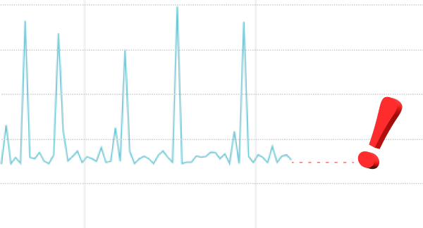

# check-mackerel-metric



[日本語](#説明)

## Description

Checks Mackerel host metrics (or service metrics) are still being posted.

It is also available in the host metric of cloud integrations.

## Synopsis
```
check-mackerel-metric -H HOST_ID -n METRIC_NAME -w WARNING_MINUTE -c CRITICAL_MINUTE
check-mackerel-metric -s SERVICE_NAME -n METRIC_NAME -w WARNING_MINUTE -c CRITICAL_MINUTE
```

CRITICAL (or WARNING) alert is issued if no metric has been posted since the minute specified for CRITICAL_MINUTE (or WARNING_MINUTE) from the current time.

## Setting for mackerel-agent
You can install the plugin by `mkr` command.

##### Linux
```
sudo mkr plugin install check-mackerel-metric
```

##### Windows
(by Administrator)

```
"C:\Program Files\Mackerel\mackerel-agent\mkr.exe" plugin install check-mackerel-metric
```

Add plugin configuration into mackerel-agent.conf.

##### Linux
```
[plugin.checks.metric-myhost]
command = ["/opt/mackerel-agent/plugins/bin/check-mackerel-metric", "-H", "HOST_ID", "-n", "METRIC_NAME", "-w", "WARNING_MINUTE", "-c", "CRITICAL_MINUTE"]

[plugin.checks.metric-myservice]
command = ["/opt/mackerel-agent/plugins/bin/check-mackerel-metric", "-s", "SERVICE_NAME", "-n", "METRIC_NAME", "-w", "WARNING_MINUTE", "-c", "CRITICAL_MINUTE"]
```

##### Windows
```
[plugin.checks.metric-myhost]
command = ["plugins\\bin\\check-mackerel-metric.exe", "-H", "HOST_ID", "-n", "METRIC_NAME", "-w", "WARNING_MINUTE", "-c", "CRITICAL_MINUTE"]

[plugin.checks.metric-myservice]
command = ["plugins\\bin\\check-mackerel-metric.exe", "-s", "SERVICE_NAME", "-n", "METRIC_NAME", "-w", "WARNING_MINUTE", "-c", "CRITICAL_MINUTE"]
```

## Usage
### Options
- `--host HOST_ID, -H HOST_ID`: target host ID
- `--service SERVICE_NAME, -s SERVICE_NAME`: target service name
- `--name METRIC_NAME, -n METRIC_NAME`: target metric name
- `--warning MINUTE, -w MINUTE`: minute to be WARNING (MINUTE: 1-1441)
- `--critical MINUTE, -c MINUTE`: minute to be CRITICAL (MINUTE: 1-1441)
- `--status-as STATUS=NEWSTATUS,[STATUS=NEWSTATUS,...]`: override the status
- `--help, -h`: display the help and exit
- `--version`: display version and exit
  - `--host` is for host metrics and `--service` is for service metrics. Choose one of these.
  - HOST_ID is displayed at the top of the Mackerel host screen, like `4Hkc5RWzXXX`.
  - METRIC_NAME can be looked up with `mkr metric-names -H HOST_ID`.
  - The API key is taken from the existing mackerel-agent.conf. If you want to use a different API key, you can specify it in the environment variable `MACKEREL_APIKEY`.
  - If `--warning` and `--critical` are set to the same value, only critical alert is enabled.
  - `--status-as` overrides the state to be reported. It is set to return the actual state of `ok`, `warning`, `critical` or `unknown` as the specified state, in the format `STATUS=NEWSTATUS`. For example, with `--status-as critical=warning,unknown=ok`, a CRITICAL alert will be reported as a WARNING alert, and an UNKNOWN alert will be treated as OK.

## License
© 2023 Hatena Co., Ltd.

Apache License (see LICENSE file)

---

## 説明

Mackerelのホストメトリックあるいはサービスメトリックの投稿が継続していることをチェックします。

クラウドインテグレーションのホストメトリックでも利用可能です。

## 概要
```
check-mackerel-metric -H HOST_ID -n METRIC_NAME -w WARNING_MINUTE -c CRITICAL_MINUTE
check-mackerel-metric -s SERVICE_NAME -n METRIC_NAME -w WARNING_MINUTE -c CRITICAL_MINUTE
```

現在時刻から CRITICAL_MINUTE (または WARNING_MINUTE) 分前の間に何もメトリックの投稿がないときに、CRITICAL (または WARNING) アラートが発報されます。

## mackerel-agentでの設定
プラグインは `mkr` コマンドでインストールできます。

##### Linux
```
sudo mkr plugin install check-mackerel-metric
```

##### Windows
(管理者権限)

```
"C:\Program Files\Mackerel\mackerel-agent\mkr.exe" plugin install check-mackerel-metric
```

mackerel-agent.conf にプラグインの設定を記述してください。

##### Linux
```
[plugin.checks.metric-myhost]
command = ["/opt/mackerel-agent/plugins/bin/check-mackerel-metric", "-H", "HOST_ID", "-n", "METRIC_NAME", "-w", "WARNING_MINUTE", "-c", "CRITICAL_MINUTE"]

[plugin.checks.metric-myservice]
command = ["/opt/mackerel-agent/plugins/bin/check-mackerel-metric", "-s", "SERVICE_NAME", "-n", "METRIC_NAME", "-w", "WARNING_MINUTE", "-c", "CRITICAL_MINUTE"]
```

##### Windows
```
[plugin.checks.metric-myhost]
command = ["plugins\\bin\\check-mackerel-metric.exe", "-H", "HOST_ID", "-n", "METRIC_NAME", "-w", "WARNING_MINUTE", "-c", "CRITICAL_MINUTE"]

[plugin.checks.metric-myservice]
command = ["plugins\\bin\\check-mackerel-metric.exe", "-s", "SERVICE_NAME", "-n", "METRIC_NAME", "-w", "WARNING_MINUTE", "-c", "CRITICAL_MINUTE"]
```

## 使い方
### オプション
- `--host HOST_ID, -H HOST_ID`: 対象のホストID
- `--service SERVICE_NAME, -s SERVICE_NAME`: 対象のサービス名
- `--name METRIC_NAME, -n METRIC_NAME`: 対象のメトリック名
- `--warning MINUTE, -w MINUTE`: 指定の分数内にメトリックがなければWARNING（MINUTEは1〜1441）
- `--critical MINUTE, -c MINUTE`: 指定の分数内にメトリックがなければCRITICAL（MINUTEは1〜1441）
- `--status-as STATUS=NEWSTATUS,[STATUS=NEWSTATUS,...]`: 状態の書き換え
- `--help, -h`: ヘルプの表示と終了
- `--version`: バージョンの表示と終了
  - `--host`はホストメトリック用、`--service`はサービスメトリック用です。どちらか1つを選んでください。
  - HOST_ID (ホストID) はMackerelのホスト画面の上部に `4Hkc5RWzXXX` のように表示されています。
  - METRIC_NAME (メトリック名) は `mkr metric-names -H HOST_ID` で調べることができます。
  - APIキーは既存のmackerel-agent.confから取得されます。別のAPIキーを利用したいときには、環境変数`MACKEREL_APIKEY`で指定できます。
  - `--warning` と `--critical` の値を同じ値に設定すると、CRITICALアラートのみが発報されます。
  - `--status-as` は発報する状態を書き換えます。`STATUS=NEWSTATUS` の書式で、`ok`、`warning`、`critical`、`unknown` のそれぞれの実際の状態を別の状態として返すよう設定します。たとえば `--status-as critical=warning,unknown=ok` とすると、CRITICALアラートはWARNINGアラートとして発報され、UNKNOWNアラートは正常として扱われます。

## ライセンス
© 2023 Hatena Co., Ltd.

Apache License (LICENSE ファイル参照)
